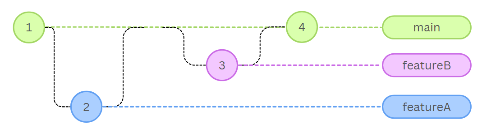

# 👻🚫 **Ejercicio: Cazafantasmas**   

**🎯 Objetivo:** Utilizar Git y GitHub para desarrollar un tablero de control que permita registrar fantasmas, asignarles un nivel de peligro y marcarlos como capturados.

---

‼️ **Importante:** Luego de clonar el repositorio modifica las siguientes líneas con tu nombre y número de estudiante, y realiza un commit con el mensaje `"Update README.md"`:

- **Nombre:** XXXXXXXX  
- **Número de estudiante:** XXXXXXXX  

---

## 💻 **Parte A - Simulación de comandos** 

Observa el siguiente grafo de commits:

	

1. **Crea un issue de GitHub** titulado **"Parte A"** y escribe en él los comandos de Git necesarios para replicar la estructura de commits y ramas del grafo anterior.
 
    **⚠️ Aclaraciones**
    - La cronología se lee de izquierda a derecha
    - Cada nodo es un commit (usar como mensaje el número de commit)
    - Hay tres ramas con su nombre correspondiente
    - Se debe comenzar la secuencia con el commit 1 de la rama `main`
---

## 👻 **Parte B - Documentación y desarrollo del tablero de control**  

### 📄 Documentación
1. Estando en la rama main, realiza los siguientes pasos:

   1. Edita el archivo `docs/informe.md` y agrega:  
      - Título: `Tablero de Control para Cazafantasmas`  
      - Subtítulo: `Nuevas funcionalidades`  
      - Una lista con las funciones a implementar:  
        - `addGhost`  
        - `setDangerLevel`  
        - `captureGhost`  

   2. Realiza un commit con el mensaje: `"Add documentación de funcionalidades"`

   3. Sube la rama `main` al repositorio remoto.  

### 🛠️ Desarrollo

‼️ **Importante:** A partir de este punto, cada funcionalidad se implementará en una rama diferente antes de fusionarse con `main`.

#### 👻 Implementación de función para agregar fantasmas
 1.  Desde `main`, crea y muévete a una nueva rama llamada `add-ghost`. En ella realiza los siguientes pasos:
     1. Ubica la función `create_ghost` en `src/ghostbusters.js`.
     2. Modifica su nombre a `add_ghost`.
     3. Sustituye la línea `TODO` por el siguiente código:
         ```javascript
         ghosts.push({
             name: ghost.name,
             dangerLevel: ghost.dangerLevel,
             captured: false,
         });
         ```
     4. Haz commit con el mensaje:  `"Add feature agregar fantasmas"`
 2. Sube la rama `add-ghost` al repositorio remoto.  

#### ✏️ Modificación de nombres para cumplir con convenciones 
  
1. Desde `main`, crea y muévete a una nueva rama llamada `naming-conventions`.  
2. Modifica los nombres de la funciones en `src/ghostbusters.js`:
   1. Cambia `create_ghost` a `addGhost`.
   2. Cambia `set_DANGER_LEVEL` a `setDangerLevel`.
   2. Cambia `CAPTUREGHOST3` a `captureGhost`.
   
3. Haz commit con el mensaje:  `"Refactor nombres de funciones a formato Camel Case"`
4. Sube la rama `naming-conventions` al repositorio remoto.  

#### ⚔️ Integración y resolución de conflictos

1. Desde `main`, hacer merge de `add-ghost`.
2. Desde `main`, hacer merge de `naming-conventions`.
   - Aquí habrá un conflicto en `src/ghostbusters.js` porque tanto en `add-ghost` como en `naming-conventions` se modificó una misma línea de código (el nombre de la función `addGhost`). Resuelve el conflicto manualmente en `src/ghostbusters.js` de manera que quede el nombre más reciente y el código que agregaste. Luego completa el merge.
1. Sube la rama `main` al repositorio remoto.  

### 🏷️ Tag e Historial

1. Desde `main`, agrega un tag v1.0 al último commit.
2. Obtén el historial (log) gráfico de cambios realizados (💡 utilizar `--oneline --graph`) y captura la pantalla.
3. Sube la captura de pantalla en un **issue en GitHub** titulado **"Parte B"**.  

---

> 📌 ***Nota:*** *Este ejercicio fue elaborado con ayuda de herramientas de Inteligencia Artificial.*